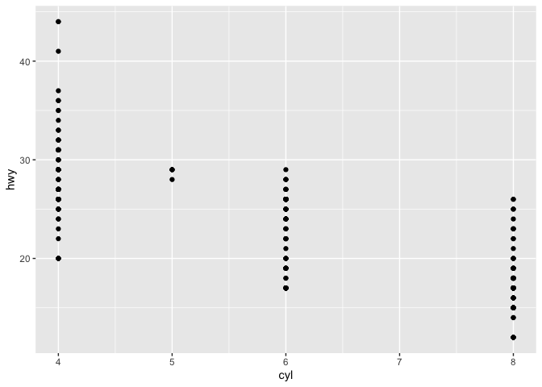
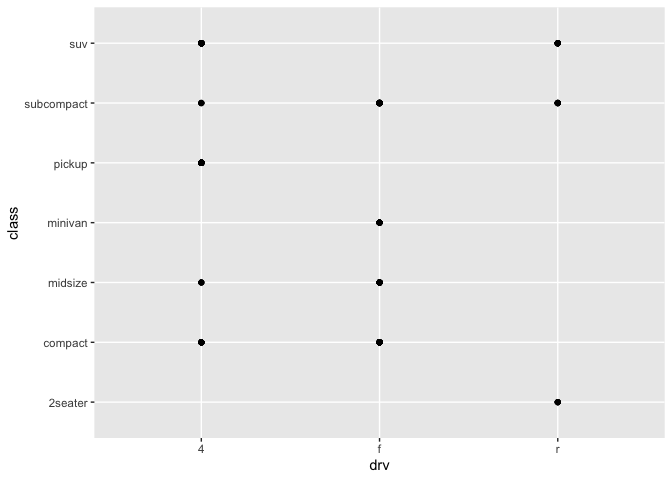
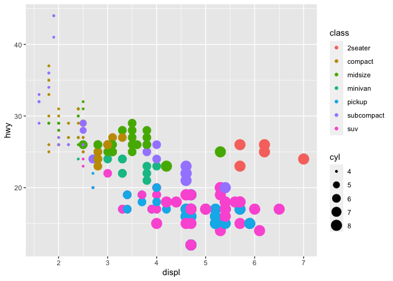
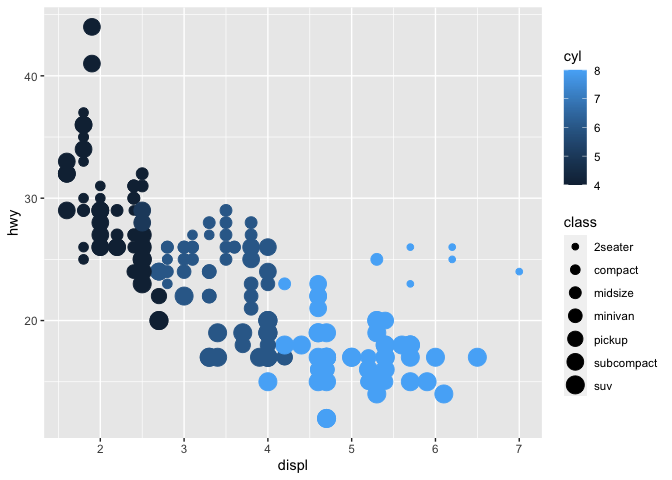
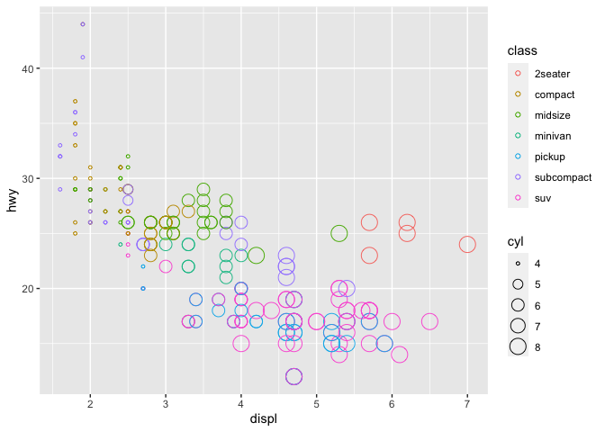
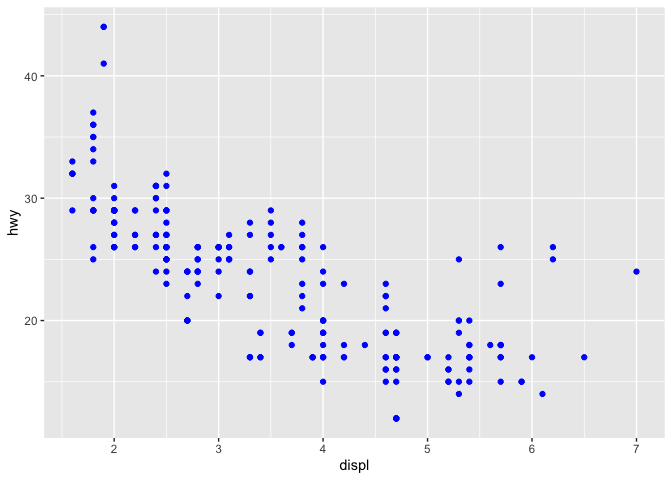
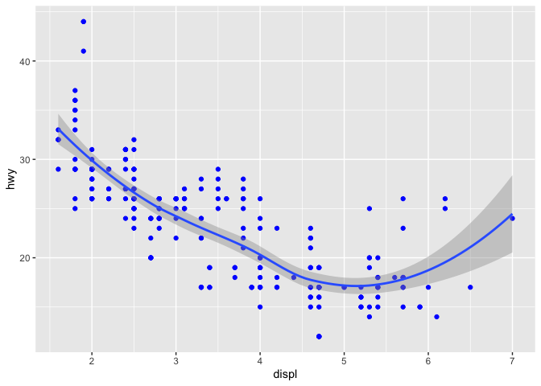
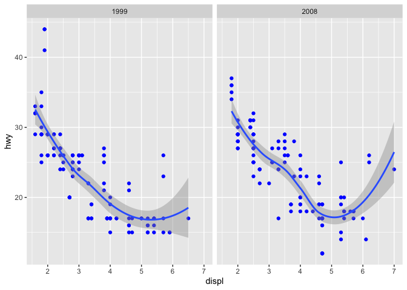
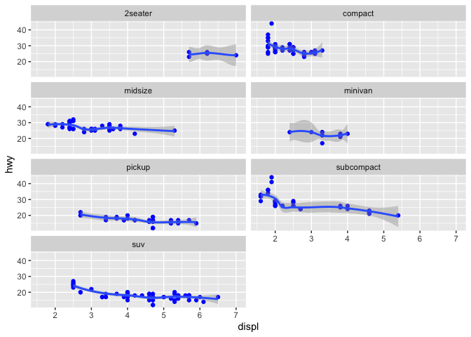

About
================
bhm48, dl2236, ls929

<b> [dl2236’s github account](https://github.com/ls5340/r-collab-.git)
<br>

<b> [bhm48’s github account](https://github.com/ls5340/r-collab-.git)
<br>

<b> [ls929’s github account](https://github.com/ls5340/r-collab-.git)
<br>


<center>
**Three Boys**
</center>

<b> <br>

## R Markdown

This is an R Markdown document. Markdown is a simple formatting syntax
for authoring HTML, PDF, and MS Word documents. For more details on
using R Markdown see <http://rmarkdown.rstudio.com>.

When you click the **Knit** button a document will be generated that
includes both content as well as the output of any embedded R code
chunks within the document. You can embed an R code chunk like this:

``` r
summary(cars)
```

    ##      speed           dist       
    ##  Min.   : 4.0   Min.   :  2.00  
    ##  1st Qu.:12.0   1st Qu.: 26.00  
    ##  Median :15.0   Median : 36.00  
    ##  Mean   :15.4   Mean   : 42.98  
    ##  3rd Qu.:19.0   3rd Qu.: 56.00  
    ##  Max.   :25.0   Max.   :120.00

## ggplot

``` r
#ggplot lesson 1

library(tidyverse)

head(cars)
```

    ##   speed dist
    ## 1     4    2
    ## 2     4   10
    ## 3     7    4
    ## 4     7   22
    ## 5     8   16
    ## 6     9   10

``` r
tail(cars, 10)
```

    ##    speed dist
    ## 41    20   52
    ## 42    20   56
    ## 43    20   64
    ## 44    22   66
    ## 45    23   54
    ## 46    24   70
    ## 47    24   92
    ## 48    24   93
    ## 49    24  120
    ## 50    25   85

``` r
?ggplot
#ggplot(data = <DATA>) + 
#  <GEOM_FUNCTION>(
#    mapping = aes(<MAPPINGS>),
    
ggplot(data = mpg) +
  geom_point(mapping = aes(x = displ, y = hwy))
```

<!-- -->

``` r
ggplot(data = mpg) +
  geom_point(mapping = aes(x = cyl, y = hwy))
```

<!-- -->

``` r
ggplot(data = mpg) +
  geom_point(mapping = aes(x = drv, y = class))
```

<!-- -->

``` r
ggplot(data = mpg) +
  geom_point(mapping = aes(x = displ, y = hwy, color = class, size = cyl))
```

<!-- -->

``` r
ggplot(data = mpg) +
  geom_point(mapping = aes(x = displ, y = hwy, color = cyl, size = class))
```

    ## Warning: Using size for a discrete variable is not advised.

<!-- -->

``` r
ggplot(data = mpg) +
  geom_point(mapping = aes(x = displ, y = hwy, color = class, size = cyl), shape = 1)
```

<!-- -->

``` r
ggplot(data = mpg) +
  geom_point(mapping = aes(x = displ, y = hwy), color = "blue")
```

<!-- -->

``` r
ggplot(data = mpg) +
  geom_point(mapping = aes(x = displ, y = hwy), color = "blue") +
  geom_smooth(mapping = aes(x = displ, y = hwy))
```

<!-- -->

``` r
ggplot(data = mpg, mapping = aes(x = displ, y = hwy)) +
  geom_point(color = "blue") +
  geom_smooth() +
  facet_wrap(~ year)
```

<!-- -->

``` r
ggplot(data = mpg, mapping = aes(x = displ, y = hwy)) +
  geom_point(color = "blue") +
  geom_smooth() +
  facet_wrap(~ class, ncol = 2)
```

    ## Warning in simpleLoess(y, x, w, span, degree = degree, parametric =
    ## parametric, : span too small. fewer data values than degrees of freedom.

    ## Warning in simpleLoess(y, x, w, span, degree = degree, parametric =
    ## parametric, : pseudoinverse used at 5.6935

    ## Warning in simpleLoess(y, x, w, span, degree = degree, parametric =
    ## parametric, : neighborhood radius 0.5065

    ## Warning in simpleLoess(y, x, w, span, degree = degree, parametric =
    ## parametric, : reciprocal condition number 0

    ## Warning in simpleLoess(y, x, w, span, degree = degree, parametric =
    ## parametric, : There are other near singularities as well. 0.65044

    ## Warning in predLoess(object$y, object$x, newx = if
    ## (is.null(newdata)) object$x else if (is.data.frame(newdata))
    ## as.matrix(model.frame(delete.response(terms(object)), : span too small. fewer
    ## data values than degrees of freedom.

    ## Warning in predLoess(object$y, object$x, newx = if
    ## (is.null(newdata)) object$x else if (is.data.frame(newdata))
    ## as.matrix(model.frame(delete.response(terms(object)), : pseudoinverse used at
    ## 5.6935

    ## Warning in predLoess(object$y, object$x, newx = if
    ## (is.null(newdata)) object$x else if (is.data.frame(newdata))
    ## as.matrix(model.frame(delete.response(terms(object)), : neighborhood radius
    ## 0.5065

    ## Warning in predLoess(object$y, object$x, newx = if
    ## (is.null(newdata)) object$x else if (is.data.frame(newdata))
    ## as.matrix(model.frame(delete.response(terms(object)), : reciprocal condition
    ## number 0

    ## Warning in predLoess(object$y, object$x, newx = if
    ## (is.null(newdata)) object$x else if (is.data.frame(newdata))
    ## as.matrix(model.frame(delete.response(terms(object)), : There are other near
    ## singularities as well. 0.65044

    ## Warning in simpleLoess(y, x, w, span, degree = degree, parametric =
    ## parametric, : pseudoinverse used at 4.008

    ## Warning in simpleLoess(y, x, w, span, degree = degree, parametric =
    ## parametric, : neighborhood radius 0.708

    ## Warning in simpleLoess(y, x, w, span, degree = degree, parametric =
    ## parametric, : reciprocal condition number 0

    ## Warning in simpleLoess(y, x, w, span, degree = degree, parametric =
    ## parametric, : There are other near singularities as well. 0.25

    ## Warning in predLoess(object$y, object$x, newx = if
    ## (is.null(newdata)) object$x else if (is.data.frame(newdata))
    ## as.matrix(model.frame(delete.response(terms(object)), : pseudoinverse used at
    ## 4.008

    ## Warning in predLoess(object$y, object$x, newx = if
    ## (is.null(newdata)) object$x else if (is.data.frame(newdata))
    ## as.matrix(model.frame(delete.response(terms(object)), : neighborhood radius
    ## 0.708

    ## Warning in predLoess(object$y, object$x, newx = if
    ## (is.null(newdata)) object$x else if (is.data.frame(newdata))
    ## as.matrix(model.frame(delete.response(terms(object)), : reciprocal condition
    ## number 0

    ## Warning in predLoess(object$y, object$x, newx = if
    ## (is.null(newdata)) object$x else if (is.data.frame(newdata))
    ## as.matrix(model.frame(delete.response(terms(object)), : There are other near
    ## singularities as well. 0.25

<!-- -->

``` r
#    stat = <STAT>, 
#    position = <POSITION>
#  ) +
#  <COORDINATE_FUNCTION> +
#  <FACET_FUNCTION> +
#  <THEME_FUNCTION>
```
